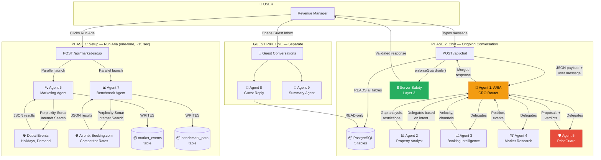
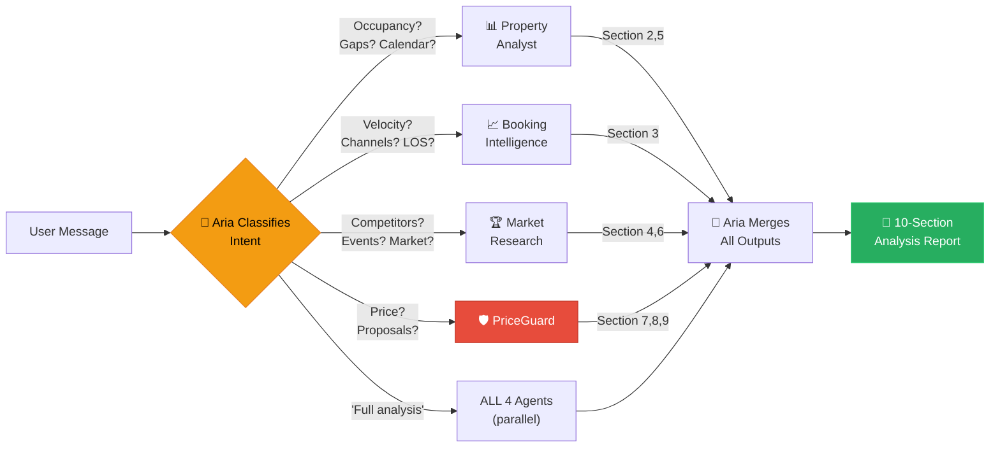
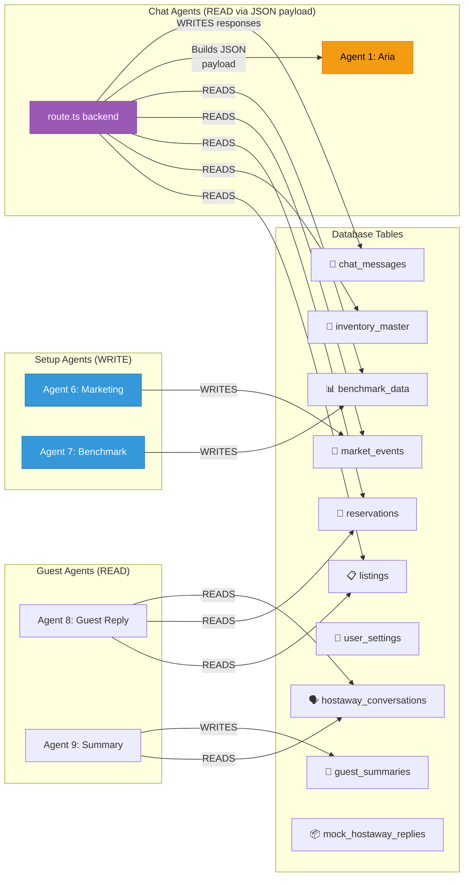

# PriceOS — Architecture & Technical Deep Dive
## AI-Powered Revenue Management for Dubai Short-Term Rentals

**Version:** 2.0 | **Date:** March 4, 2026 | **Prepared for:** Client Review Meeting

---

## Table of Contents

1. [Executive Summary](#1-executive-summary)
2. [System Overview & Architecture](#2-system-overview--architecture)
3. [The Two Phases: Setup & Chat](#3-the-two-phases-setup--chat)
4. [The 9-Agent System — In Detail](#4-the-9-agent-system--in-detail)
5. [Agent Orchestration — How Agents Connect](#5-agent-orchestration--how-agents-connect) ⭐ NEW
6. [Data Flow — From Database to AI to User](#6-data-flow--from-database-to-ai-to-user)
7. [The Pricing Formula — Step by Step](#7-the-pricing-formula--step-by-step)
8. [Safety & Guardrails System](#8-safety--guardrails-system)
9. [PMS Integration & Data Sync](#9-pms-integration--data-sync) ⭐ NEW
10. [Post-Approval: What Happens Next?](#10-post-approval-what-happens-next) ⭐ NEW
11. [Security & Access Control](#11-security--access-control) ⭐ NEW
12. [Performance & Response Times](#12-performance--response-times) ⭐ NEW
13. [Cost Model & API Economics](#13-cost-model--api-economics) ⭐ NEW
14. [Error Handling & Fallbacks](#14-error-handling--fallbacks) ⭐ NEW
15. [What Data Is Stored & Where](#15-what-data-is-stored--where)
16. [User Interface Walkthrough](#16-user-interface-walkthrough)
17. [Real Example: Full Analysis Output](#17-real-example-full-analysis-output) ⭐ NEW
18. [Onboarding Tour Guide](#18-onboarding-tour-guide)
19. [Technology Stack](#19-technology-stack)
20. [What's Complete & What's Next](#20-whats-complete--whats-next)
21. [FAQ — Frequently Asked Questions](#21-faq--frequently-asked-questions) ⭐ NEW
22. [Glossary](#appendix-glossary)

---

## 1. Executive Summary

PriceOS is an **AI-powered revenue management platform** designed specifically for Dubai's short-term rental (STR) market. It helps property managers and revenue managers:

- **Analyze** their property's occupancy, booking velocity, and revenue performance
- **Research** competitor rates and market events in real-time via internet search
- **Optimize** nightly pricing using AI-driven formulas with safety guardrails
- **Communicate** with guests using AI-suggested replies
- **Decide** confidently with a comprehensive 10-section analysis report

### How It Works — In One Sentence

> A Revenue Manager selects a property and date range → clicks "Run Aria" → AI agents scan the internet for competitor rates and events → the manager chats with "Aria" (the AI Revenue Manager) to get pricing optimization proposals → reviews and approves them.

### Key Numbers

| Metric | Value |
|--------|-------|
| AI Agents | 9 specialized agents |
| Database Tables | 10 tables (PostgreSQL) |
| API Routes | 40+ Next.js API routes |
| LLM Models | Gemini 3.0 Flash, GPT-4o-mini, Perplexity Sonar |
| Safety Layers | 3 (Prompt rules + PriceGuard agent + Server-side code) |
| Analysis Sections | 10 (in Full Analysis report) |

> **📸 Screenshot placeholder:** _Insert full-page screenshot of the PriceOS dashboard here_

---

## 2. System Overview & Architecture

### High-Level Architecture Diagram

```
┌──────────────────────────────────────────────────────────────────────┐
│                        FRONTEND (Next.js 16)                         │
│  ┌──────────┐  ┌─────────────────────────┐  ┌────────────────────┐  │
│  │ Property  │  │    Chat Interface       │  │   Right Sidebar    │  │
│  │ List      │  │  (Aria conversations)   │  │  Summary/Signals/  │  │
│  │ Sidebar   │  │  Date Range Picker      │  │  Calendar          │  │
│  │           │  │  Run Aria Button         │  │                    │  │
│  │           │  │  Guardrails Editor       │  │                    │  │
│  └──────────┘  └─────────────────────────┘  └────────────────────┘  │
└──────────────────────────┬───────────────────────────────────────────┘
                           │ API Calls
┌──────────────────────────▼───────────────────────────────────────────┐
│                      BACKEND (Next.js API Routes)                    │
│  /api/chat         — Send messages to Aria                           │
│  /api/market-setup — Run internet research agents                    │
│  /api/calendar-metrics — Compute occupancy/ADR                       │
│  /api/benchmark    — Fetch competitor data                           │
│  /api/events       — Fetch market events                             │
│  /api/hostaway/*   — Guest conversation management                   │
└──────────────────────────┬───────────────────────────────────────────┘
                           │
          ┌────────────────┼────────────────┐
          ▼                ▼                ▼
┌─────────────┐  ┌─────────────┐  ┌─────────────────┐
│  PostgreSQL  │  │   Lyzr AI   │  │  Perplexity     │
│  (Neon DB)   │  │  Studio     │  │  Sonar API      │
│  10 tables   │  │  (Agent     │  │  (Internet      │
│              │  │   hosting)  │  │   search)       │
└─────────────┘  └─────────────┘  └─────────────────┘
```

### The Three-Panel Layout

PriceOS uses a **three-panel layout** on the main screen:

| Panel | Width | Purpose |
|-------|-------|---------|
| **Left — Property List** | ~240px | Shows all properties with occupancy % and target rate. Click to select. |
| **Center — Chat + Controls** | Flexible | Agent/Guest mode toggle, date picker, Run Aria button, chat with Aria |
| **Right — Intelligence Sidebar** | ~320px | Summary metrics, Market Signals, Calendar heatmap |

> **📸 Screenshot placeholder:** _Insert annotated screenshot showing the three panels with labels_

---

## 3. The Two Phases: Setup & Chat

PriceOS operates in **two distinct phases**. Understanding this separation is key to understanding the architecture.

### Phase 1: Setup (Triggered by "Run Aria" Button)

**What happens:** Two internet-search agents run in parallel, scanning the web for:
- Upcoming events in Dubai (Art Dubai, Ramadan, GITEX, etc.)
- Real competitor pricing from Airbnb, Booking.com, and other OTAs

**Duration:** ~15 seconds

**Technical flow:**
```
User clicks "Run Aria"
    ↓
Frontend → POST /api/market-setup
    ↓
┌─── Parallel ─────────────────────────────────────────┐
│                                                       │
│  Agent 6 (Marketing Agent)     Agent 7 (Benchmark)   │
│  Uses: Perplexity Sonar        Uses: Perplexity Sonar│
│  Searches: Dubai events,       Searches: Airbnb,     │
│  holidays, demand outlook      Booking.com rates     │
│       ↓                              ↓               │
│  Saves to:                     Saves to:             │
│  market_events table           benchmark_data table  │
│                                                       │
└───────────────────────────────────────────────────────┘
    ↓
Toast: "Aria is Ready"
Chat interface activated
```

> **📸 Screenshot placeholder:** _Insert screenshot showing the "Run Aria" button and the toast notification "Aria is Ready"_

### Phase 2: Chat (User Messages to Aria)

**What happens:** The user types questions or requests. Aria (the CRO Router agent) classifies the intent, delegates to specialized sub-agents, merges their outputs, and responds.

**Key distinction:** Chat agents do NOT search the internet. They read from the database (data that was saved during Setup).

**Technical flow:**
```
User types "Full analysis"
    ↓
Frontend → POST /api/chat
    ↓
Backend (route.ts):
  1. Fetch ALL property data from PostgreSQL
     - listing details, inventory, reservations
     - market_events (from Setup), benchmark_data (from Setup)
  2. Build JSON payload
  3. Inject payload into the FIRST message to Lyzr
    ↓
Lyzr AI (Agent 1: Aria CRO Router):
  4. Classify intent → "Full analysis"
  5. Delegate to ALL 4 sub-agents
  6. Merge outputs → 10-section response
    ↓
Backend (route.ts):
  7. Parse proposals from response
  8. Run enforceGuardrails() — server-side safety
  9. Save to chat_messages table
  10. Return to frontend
    ↓
Frontend:
  11. Display formatted response + proposal cards
```

> **📸 Screenshot placeholder:** _Insert screenshot showing a "Full Analysis" response from Aria with all 10 sections visible_

---

## 4. The 9-Agent System — In Detail

PriceOS uses a **multi-agent architecture** where each agent is a specialized AI with a specific role. They are organized into three groups:

### Group A: Chat Agents (Agents 1-5) — Run During Conversation

These agents receive data through a JSON payload (injected by the backend) and have **ZERO database access**. This makes them:
- **Secure**: They can't leak or modify data
- **Testable**: Give them the same input, get the same output
- **Fast**: No database queries during chat

---

#### Agent 1: Aria (CRO Router)
| Detail | Value |
|--------|-------|
| **Model** | Gemini 3.0 Flash Preview |
| **Temperature** | 0.2 (factual, low creativity) |
| **Max Tokens** | 4,000 |
| **Role** | User-facing orchestrator |
| **Persona** | "Aria, your AI Revenue Manager" |

**What it does:**
1. Reads the user's message
2. Classifies their intent using a routing table (see below)
3. Delegates to the appropriate sub-agents
4. Merges all sub-agent outputs into a unified response
5. Never computes pricing itself — always delegates to PriceGuard

**Routing Table — What Triggers Which Agents:**

| User Says | Property Analyst | Booking Intel | Market Research | PriceGuard |
|-----------|:---:|:---:|:---:|:---:|
| "What's my occupancy?" | ✅ | — | — | — |
| "Booking velocity" | — | ✅ | — | — |
| "Competitor rates" | — | — | ✅ | — |
| "What should I price?" | ✅ | — | ✅ | ✅ |
| **"Full analysis"** | **✅** | **✅** | **✅** | **✅** |
| "Adjust min stay" | ✅ | — | — | — |

**Full Analysis Output — 10 Sections:**

| # | Section | What It Contains |
|---|---------|------------------|
| 1 | 📍 Executive Summary | 2-3 line overview with health assessment |
| 2 | 📊 Performance Scorecard | Occupancy, ADR, floor/ceiling, market position |
| 3 | 📈 Booking Intelligence | Velocity trend, LOS buckets, channel mix |
| 4 | 🏆 Competitor Positioning | P25-P90 rate distribution, percentile |
| 5 | 📅 Gap Analysis | Specific vacant gaps, orphan nights |
| 6 | 🎪 Event Calendar & Impact | Upcoming events with premium factors |
| 7 | 💰 Pricing Strategy | WHY each tier differs (weekday/weekend/event) |
| 8 | 📈 Revenue Projection | Current vs proposed revenue, uplift % |
| 9 | ⚠️ Risk Summary | Low/Medium/High risk counts |
| 10 | ✅ Action Items | Numbered next steps |

> **📸 Screenshot placeholder:** _Insert screenshot of a full analysis response showing at least the first 5 sections_

---

#### Agent 2: Property Analyst
| Detail | Value |
|--------|-------|
| **Model** | GPT-4o-mini |
| **Temperature** | 0.1 |
| **Max Tokens** | 1,500 |
| **Role** | Calendar and gap analysis |

**What it receives:** Property details, inventory data, reservations, analysis window
**What it returns:** Gap nights, restriction recommendations, revenue calculations, seasonal patterns

**Key logic:**
- Detects gap types: 1-night orphan, 2-night micro-gap, 3-night gap, last-minute
- Recommends LOS (Length of Stay) relaxation before discounting
- Auto-revert rule: If a LOS change isn't filled 48 hours before check-in → revert to original

---

#### Agent 3: Booking Intelligence
| Detail | Value |
|--------|-------|
| **Model** | GPT-4o-mini |
| **Temperature** | 0.1 |
| **Max Tokens** | 1,500 |
| **Role** | Reservation pattern analysis |

**What it receives:** Reservations list, metrics, analysis window
**What it returns:** Booking velocity, LOS buckets, channel mix, cancellation rate

**Key calculations:**
- **Velocity**: Accelerating / Stable / Decelerating (based on recent booking frequency)
- **LOS Buckets**: 1-2 nights, 3-4 nights, 5-7 nights, 7+ nights
- **Channel Mix**: % breakdown (e.g., Airbnb 60%, Booking.com 30%, Direct 10%)

---

#### Agent 4: Market Research
| Detail | Value |
|--------|-------|
| **Model** | GPT-4o-mini |
| **Temperature** | 0.1 |
| **Max Tokens** | 1,500 |
| **Role** | Competitor and event analysis |

**What it receives:** Market events, benchmark data, property details
**What it returns:** Event impact ratings, competitor comparisons, market positioning

**Key outputs:**
- Market position verdict: UNDERPRICED / FAIR / SLIGHTLY_ABOVE / OVERPRICED
- Percentile ranking (e.g., "Your property is at the 65th percentile")
- Event premium factors: Low (1.05x), Medium (1.15x), High (1.30x)

---

#### Agent 5: PriceGuard (Safety-Critical)
| Detail | Value |
|--------|-------|
| **Model** | GPT-4o-mini |
| **Temperature** | 0.0 (zero creativity — strictly deterministic) |
| **Max Tokens** | 1,200 |
| **Role** | Pricing engine + final safety validator |

**This is the most important agent.** It has **unconditional veto power** — if PriceGuard says REJECTED, the CRO Router cannot override it.

**Detailed pricing formula is in [Section 6](#6-the-pricing-formula--step-by-step).**

---

### Group B: Setup Agents (Agents 6-7) — Run Once Per "Run Aria"

These agents are **internet-search agents** using Perplexity Sonar (an LLM that can search the web). They run **only** when the user clicks "Run Aria" and write their findings directly to the database.

---

#### Agent 6: Marketing Agent
| Detail | Value |
|--------|-------|
| **Model** | GPT-4o (via Perplexity Sonar) |
| **Tool** | Internet search |
| **Writes to** | `market_events` table |

**What it searches for:**
- Upcoming events (Art Dubai, GITEX, F1 Abu Dhabi, Ramadan, etc.)
- Holidays and observances
- Demand outlook and seasonal trends
- Competitor intel (occupancy trends, pricing trends)

**Output format:** Strict JSON array of events, each with:
```json
{
  "title": "Art Dubai 2026",
  "start_date": "2026-03-06",
  "end_date": "2026-03-09",
  "event_type": "event",
  "expected_impact": "high",
  "confidence": 90,
  "suggested_premium_pct": 25,
  "source": "artdubai.ae",
  "description": "Major international art fair..."
}
```

---

#### Agent 7: Benchmark Agent
| Detail | Value |
|--------|-------|
| **Model** | GPT-4o (via Perplexity Sonar) |
| **Tool** | Internet search |
| **Writes to** | `benchmark_data` table |

**What it searches for:**
- Exact nightly rates on Airbnb and Booking.com
- Properties in the same area, same bedroom count
- Rate distribution: P25, P50 (median), P75, P90
- Weekday vs weekend vs event pricing

**Output format:** Strict JSON with comparables:
```json
{
  "verdict": "FAIR",
  "percentile": 65,
  "p25_rate": 350,
  "p50_rate": 450,
  "p75_rate": 600,
  "p90_rate": 800,
  "recommended_weekday": 420,
  "recommended_weekend": 550,
  "recommended_event": 700,
  "comps": [
    { "name": "Marina Vista Studio", "source": "Airbnb", "avgRate": 480, "rating": 4.7 },
    { "name": "JBR Beachfront 1BR", "source": "Booking.com", "avgRate": 520, "rating": 4.5 }
  ]
}
```

---

### Group C: Guest Agents (Agents 8-9) — Separate Pipeline

These agents handle guest communication and operate independently from the pricing pipeline.

#### Agent 8: Guest Reply Agent
| Detail | Value |
|--------|-------|
| **Model** | GPT-4o-mini |
| **Temperature** | 0.4 (slightly more creative for natural replies) |
| **Max Tokens** | 500 |
| **Role** | Draft guest replies |
| **Access** | READ-only database access |

**Key rules:**
- Never quote exact prices
- Never make booking promises
- Match tone to situation (complaint → empathetic, inquiry → helpful)
- Can query `listings`, `reservations`, `inventory_master`, `market_events` for factual answers

#### Agent 9: Conversation Summary Agent
| Detail | Value |
|--------|-------|
| **Model** | GPT-4o-mini |
| **Role** | Analyze all guest conversations for a property |

**Outputs:** Overall sentiment, top 5 themes, up to 5 action items, per-conversation summaries

> **📸 Screenshot placeholder:** _Insert screenshot of the Guest Inbox showing conversations and AI-suggested replies_

---

## 5. Agent Orchestration — How Agents Connect

This is the **master diagram** showing how all 9 agents interact with each other, the database, and the user.

### Diagram 1: Complete System Flow (Both Phases)



### Diagram 2: CRO Router (Aria) Internal Delegation Logic

This shows exactly HOW Aria decides which agents to call based on the user's message:



### Diagram 3: Data Flow Between Agents and Database

This shows what data each agent reads/writes:



### Key Takeaways from These Diagrams

| Principle | What It Means |
|-----------|---------------|
| **Setup agents WRITE, Chat agents READ** | Internet data is fetched once, then used many times |
| **Aria never computes prices** | She delegates to PriceGuard for all pricing decisions |
| **Server validates AFTER AI** | Even if all agents fail, `enforceGuardrails()` catches errors |
| **Guest pipeline is separate** | Guest replies never interfere with pricing analysis |
| **Data flows through ONE backend** | `route.ts` is the single gateway — no direct DB access from agents |

---

## 6. Data Flow — From Database to AI to User

### The Complete Data Journey

This is the most important section for understanding how data moves through the system.

```
STEP 1: Data Collection (Hostaway Sync)
───────────────────────────────────────
Hostaway PMS API ──sync──▶ listings table
                  ──sync──▶ reservations table
                  ──sync──▶ inventory_master table

STEP 2: Internet Research ("Run Aria")
───────────────────────────────────────
Perplexity Sonar ──Agent 6──▶ market_events table
                 ──Agent 7──▶ benchmark_data table

STEP 3: Data Injection (route.ts — on first chat message)
───────────────────────────────────────
On the user's FIRST message, route.ts:
  1. Reads from ALL 5 data tables
  2. Computes derived metrics (occupancy, ADR, channel mix)
  3. Builds a single JSON payload
  4. Injects it into the first LLM message

STEP 4: AI Processing (via Lyzr Studio)
───────────────────────────────────────
Message + JSON payload ──▶ Lyzr API ──▶ Agent 1 (Aria)
Aria ──delegates──▶ Agents 2-5
Agents 2-5 ──returns──▶ Aria ──merges──▶ Final response

STEP 5: Safety Enforcement (backend)
───────────────────────────────────────
Aria's proposals ──▶ enforceGuardrails() ──▶ Validated proposals

STEP 6: Display (frontend)
───────────────────────────────────────
Validated response ──▶ Chat message + Proposal cards ──▶ User
```

### The JSON Payload — Exactly What the AI Sees

When a user sends their first message, the backend builds this exact payload and injects it:

```json
{
  "analysis_window": {
    "from": "2026-03-04",
    "to": "2026-03-18"
  },
  "property": {
    "listingId": 227,
    "name": "JBR Beach Studio",
    "area": "Jumeirah Beach Residence",
    "city": "Dubai",
    "bedrooms": 1,
    "bathrooms": 1,
    "personCapacity": 4,
    "current_price": 400,
    "floor_price": 600,
    "ceiling_price": 1800,
    "currency": "AED"
  },
  "metrics": {
    "occupancy_pct": 47,
    "booked_nights": 7,
    "bookable_nights": 15,
    "blocked_nights": 0,
    "total_nights": 15,
    "avg_nightly_rate": 533.87
  },
  "benchmark": {
    "verdict": "FAIR",
    "percentile": 65,
    "median_market_rate": 450,
    "p25": 350,
    "p50": 450,
    "p75": 600,
    "p90": 800,
    "recommended_weekday": 420,
    "recommended_weekend": 550,
    "recommended_event": 700,
    "reasoning": "Based on 8 comparable 1BR units in JBR area..."
  },
  "market_events": [
    {
      "title": "Art Dubai 2026",
      "start_date": "2026-03-06",
      "end_date": "2026-03-09",
      "impact": "high",
      "suggested_premium_pct": 25
    }
  ],
  "recent_reservations": [
    {
      "guestName": "Ahmed",
      "startDate": "2026-03-04",
      "endDate": "2026-03-07",
      "nights": 3,
      "totalPrice": 1800,
      "channel": "Airbnb"
    }
  ]
}
```

> **📸 Screenshot placeholder:** _Insert screenshot of browser console showing the payload injection log_

---

## 6. The Pricing Formula — Step by Step

This section explains exactly how PriceOS calculates the proposed price for each date. This is performed by **Agent 5 (PriceGuard)** and then validated by **server-side code**.

### Step 1: COMPUTE the Base Price

```
For each available date:

1. Determine the BASE RATE:
   - If date falls within a market_event → base = benchmark.recommended_event
   - If date is Friday or Saturday     → base = benchmark.recommended_weekend
   - Otherwise (weekday)               → base = benchmark.recommended_weekday

2. FALLBACK (if benchmark rate is 0 or missing):
   - base = MAX(property.current_price, property.floor_price)
   - For weekends: base × 1.10
   - For event dates: base × 1.20

3. Apply EVENT FACTOR:
   - High impact event:   factor = 1.30
   - Medium impact event: factor = 1.15
   - Low impact event:    factor = 1.05
   - No event:            factor = 1.00

4. Apply OCCUPANCY ADJUSTMENT:
   - If occupancy < 30%: factor × 0.90 (low demand)
   - If occupancy > 70%: factor × 1.10 (high demand)

5. FINAL:
   proposed_price = ROUND(base × factor)
```

### Example Calculation

For a property with floor=600, ceiling=1800, current_price=400, occupancy=47%:

| Date | Day Type | Base Rate | Event Factor | Occ Adj | Proposed | After Clamp |
|------|----------|-----------|:---:|:---:|----------|-------------|
| Mar 5 (Wed) | Weekday | 420 | 1.0 | 1.0 | 420 | **600** (clamped to floor) |
| Mar 7 (Fri) | Weekend | 550 | 1.0 | 1.0 | 550 | **600** (clamped to floor) |
| Mar 8 (Sat, Art Dubai) | Event+Weekend | 700 | 1.30 | 1.0 | 910 | **910** |
| Mar 12 (Wed) | Weekday | 420 | 1.0 | 1.0 | 420 | **600** (clamped to floor) |

### Step 2: CLAMP to Guardrails

```
if proposed_price < floor_price → proposed_price = floor_price
if proposed_price > ceiling_price → proposed_price = ceiling_price
```

**This step is MANDATORY and has NO EXCEPTIONS.** Even if the formula produces a different number, the final price will always be within the floor/ceiling range.

### Step 3: VALIDATE

| Rule | Check | Result if Fails |
|------|-------|-----------------|
| Rule 1 | price ≥ floor? | **REJECT** |
| Rule 2 | price ≤ ceiling? | **REJECT** |
| Rule 3 | \|change\| ≤ 50%? | **REJECT** |
| Rule 4 | change > 25% has event justification? | **FLAG** |
| Rule 5 | price < benchmark P25? | **FLAG** |
| Rule 6 | price > benchmark P75? | **FLAG** |
| All pass | — | **APPROVED** |

### Step 4: ASSIGN Risk Level

| Change % | Risk Level |
|----------|------------|
| < 5% | 🟢 Low |
| 5-15% | 🟡 Medium |
| > 15% | 🔴 High |
| Event-driven | At least 🟡 Medium |

> **📸 Screenshot placeholder:** _Insert screenshot of proposal cards showing different risk levels and verdicts_

---

## 7. Safety & Guardrails System

PriceOS uses a **three-layer defense-in-depth** approach to ensure no dangerous pricing decisions are made:

```
┌─────────────────────────────────────────────────┐
│  LAYER 1: Prompt Instructions                   │
│  • PriceGuard prompt says "NEVER below floor"   │
│  • CRO Router prompt says "delegate to Guard"   │
│  ✓ Usually works │ ✗ LLM can hallucinate       │
├─────────────────────────────────────────────────┤
│  LAYER 2: PriceGuard Agent (LLM)                │
│  • temp=0.0 (deterministic)                     │
│  • 4-step validation pipeline                   │
│  • Unconditional veto power                     │
│  ✓ Very reliable │ ✗ Still an LLM              │
├─────────────────────────────────────────────────┤
│  LAYER 3: enforceGuardrails() (TypeScript Code) │
│  • Hardcoded in route.ts                        │
│  • Runs AFTER the LLM responds                  │
│  • Cannot be bypassed by any prompt change       │
│  ✓ ALWAYS runs │ ✓ Deterministic │ ✓ Testable  │
└─────────────────────────────────────────────────┘
```

### The Server-Side enforceGuardrails() Function

This function processes every pricing proposal AFTER the AI responds:

```
For each proposal:
  1. FLOOR CLAMP: if proposed < floor → set to floor
  2. CEILING CLAMP: if proposed > ceiling → set to ceiling
  3. SWING CHECK: if |change| > 50% → REJECT
  4. RISK COMPUTE: deterministic based on |change|%
```

### Why Three Layers?

| Scenario | Layer 1 | Layer 2 | Layer 3 | Outcome |
|----------|:---:|:---:|:---:|---------|
| Normal operation | ✅ | ✅ | ✅ | All layers agree |
| Prompt accidentally deleted | ❌ | ✅ | ✅ | PriceGuard + server still enforce |
| PriceGuard hallucinates | ✅ | ❌ | ✅ | Server code catches it |
| All prompts deleted | ❌ | ❌ | ✅ | **Server code STILL enforces** |

### Guardrails UI — How Users Set Floor/Ceiling

When a property has no guardrails set (floor=0, ceiling=0):
- The "Run Aria" button shows a **warning tooltip on hover**: _"⚠️ Please set the Guardrails first, then click Run Aria"_
- The chat input is **disabled** with placeholder text guiding the user
- The "Set Guardrails" button in the header is **highlighted in amber**

> **📸 Screenshot placeholder:** _Insert screenshot showing the guardrails tooltip warning_

> **📸 Screenshot placeholder:** _Insert screenshot showing the Set Guardrails dialog with floor/ceiling inputs_

---

## 8. Database Schema & Queries

### Entity Relationship Overview

PriceOS uses a **PostgreSQL database** (hosted on Neon) with 10 tables:

```
┌──────────────┐       ┌──────────────────┐
│   listings   │───1:N─│ inventory_master  │
│  (properties)│       │ (daily calendar)  │
└──────┬───────┘       └──────────────────┘
       │
       ├───1:N── reservations (bookings)
       │
       ├───1:N── market_events (AI-discovered events)
       │
       ├───1:N── benchmark_data (competitor rates)
       │
       ├───1:N── hostaway_conversations (guest msgs)
       │
       └───1:N── guest_summaries (AI analysis)

Standalone tables: chat_messages, user_settings, mock_hostaway_replies
```

### Table Details

#### Table 1: listings (Property Registry)
| Column | Type | Example |
|--------|------|---------|
| id | serial PK | 227 |
| name | text | "JBR Beach Studio" |
| area | text | "Jumeirah Beach Residence" |
| bedrooms_number | integer | 1 |
| price | numeric | 400.00 |
| price_floor | numeric | 600.00 |
| price_ceiling | numeric | 1800.00 |
| currency_code | varchar(3) | "AED" |
| amenities | jsonb | ["WiFi", "Pool", "Gym"] |

#### Table 2: inventory_master (Daily Price Calendar)
| Column | Type | Example |
|--------|------|---------|
| listing_id | FK → listings | 227 |
| date | date | 2026-03-10 |
| status | text | "available" / "reserved" / "blocked" |
| current_price | numeric | 400.00 |
| min_stay / max_stay | integer | 1 / 30 |
| proposed_price | numeric | 650.00 |
| change_pct | integer | 12 |
| proposal_status | text | "approved" / "pending" |

#### Table 3: reservations (Bookings)
| Column | Type | Example |
|--------|------|---------|
| listing_id | FK → listings | 227 |
| guest_name | text | "Ahmed Al-Rashid" |
| start_date / end_date | date | 2026-03-04 / 2026-03-07 |
| total_price | numeric | 1800.00 |
| price_per_night | numeric | 600.00 |
| channel_name | text | "Airbnb" |
| reservation_status | text | "confirmed" |

#### Table 4: market_events (AI Market Intelligence)
Written by Agent 6 (Marketing Agent) during Setup.
| Column | Type | Example |
|--------|------|---------|
| title | text | "Art Dubai 2026" |
| start_date / end_date | date | 2026-03-06 / 2026-03-09 |
| event_type | text | "event" / "holiday" |
| expected_impact | text | "high" / "medium" / "low" |
| suggested_premium | numeric | 25.00 |
| source | text | "artdubai.ae" |

#### Table 5: benchmark_data (Competitor Pricing)
Written by Agent 7 (Benchmark Agent) during Setup.
| Column | Type | Example |
|--------|------|---------|
| p25_rate / p50_rate / p75_rate / p90_rate | numeric | 350 / 450 / 600 / 800 |
| verdict | text | "FAIR" |
| percentile | integer | 65 |
| recommended_weekday / weekend / event | numeric | 420 / 550 / 700 |
| comps | jsonb | [{name, source, avgRate, rating}] |

### Key SQL Query Used for Occupancy

The occupancy metric displayed on all property cards is calculated with this query:

```sql
SELECT
  listing_id,
  ROUND(
    100.0 * COUNT(id) FILTER (WHERE status IN ('reserved', 'booked'))
    / NULLIF(COUNT(id) FILTER (WHERE status != 'blocked'), 0),
    0
  ) AS occupancy,
  ROUND(AVG(current_price), 2) AS avg_price
FROM inventory_master
WHERE date BETWEEN CURRENT_DATE AND CURRENT_DATE + 14
GROUP BY listing_id
```

**Explanation in plain English:**
> Count the nights that have a reservation, divide by the nights that are NOT blocked, multiply by 100 to get a percentage. Blocked nights (maintenance, owner stays) are excluded from both numerator and denominator so they don't distort the occupancy number.

---

## 9. User Interface Walkthrough

### Button & Control Reference

| # | Element | Location | What It Does |
|---|---------|----------|--------------|
| 1 | **Property Cards** | Left sidebar | Click to select a property for analysis |
| 2 | **Agent / Users Toggle** | Top of center panel | Switch between Pricing AI and Guest Inbox |
| 3 | **Date Range Picker** | Top toolbar | Set the analysis date window |
| 4 | **Set Guardrails** | Top header, beside property name | Set floor/ceiling prices |
| 5 | **Run Aria** | Top toolbar (⚙️ icon) | Launch internet research agents |
| 6 | **Chat Input** | Bottom of center panel | Type questions to Aria |
| 7 | **Sidebar Toggle** | Top header (☰ icon) | Show/hide the right sidebar |
| 8 | **Summary Tab** | Right sidebar | Occupancy, AVG rate, guest insights |
| 9 | **Signals Tab** | Right sidebar | Market events, benchmark comparisons |
| 10 | **Calendar Tab** | Right sidebar | Calendar heatmap with occupancy |

> **📸 Screenshot placeholder:** _Insert annotated screenshot with numbered arrows pointing to each element listed above_

### The User Journey — Step by Step

```
1. Login → Land on agent-chat page
2. See property list on left → Click a property
3. See guardrails warning → Click "Set Guardrails" → Enter floor/ceiling → Save
4. Select date range → e.g., Mar 4 – Mar 18
5. Click "Run Aria" → Wait ~15 seconds → Toast: "Aria is Ready"
6. Type "Full analysis" → Aria responds with 10-section report
7. Review proposals → Approve/Reject pricing suggestions
8. Switch to "Users" tab → View guest conversations → See AI-suggested replies
9. Check Signals tab → See competitor rates, market events
10. Check Calendar tab → See heatmap of occupancy by date
```

> **📸 Screenshot placeholder:** _Insert a series of 4-5 screenshots showing each step of this journey_

---

## 10. Onboarding Tour Guide

PriceOS includes a **built-in interactive onboarding tour** for first-time users. This is a professional guided walkthrough that appears automatically when a new user visits the platform.

### How It Works

1. **Welcome Modal**: A centered popup introduces "Aria" and offers "Show Me Around" or "I know my way around"
2. **Interactive Steps**: The tour highlights each UI element with a pulsing amber border
3. **Action-Driven**: Users click the actual element (not just "Next") to advance
4. **Success Animation**: A green ✅ checkmark flashes after each completed step
5. **Progress Bar**: Shows how far along the user is in the tour

### The 6 Tour Steps

| Step | Element | Instruction | What They Learn |
|------|---------|-------------|-----------------|
| 1 | Property List | "Click on any property card" | Properties have occupancy + target rate |
| 2 | Set Guardrails | "Click Set Guardrails" | Floor/ceiling protect against bad prices |
| 3 | Date Range | "Click to select dates" | Analysis is scoped to selected dates only |
| 4 | Run Aria | "Click Run Aria" | This triggers internet research |
| 5 | Chat Input | "Type 'Full analysis'" | Aria understands natural language |
| 6 | Sidebar | "Explore the tabs" | Real-time data in Summary/Signals/Calendar |

### Tour Behavior

| Scenario | What Happens |
|----------|--------------|
| First-time visitor | Tour appears automatically after 1.5 seconds |
| Returning user | Tour does NOT appear (stored in browser localStorage) |
| User clicks "Skip" | Tour is dismissed and won't appear again |
| User wants it again | Click "Restart Tour" in profile settings |

> **📸 Screenshot placeholder:** _Insert screenshot of the Welcome Modal with "Show Me Around" button_

> **📸 Screenshot placeholder:** _Insert screenshot of Step 1 with the property list highlighted and pulsing amber border_

---

## 11. Technology Stack

### Frontend

| Technology | Version | Purpose |
|-----------|---------|---------|
| Next.js | 16.1.6 | React framework with App Router |
| React | 19 | UI component library |
| TypeScript | 5.x | Type-safe JavaScript |
| Tailwind CSS | 4.x | Utility-first styling |
| Shadcn/UI | Latest | Pre-built accessible components |
| Radix UI | Latest | Headless UI primitives (tooltips, dropdowns) |
| Zustand | Latest | Lightweight state management |
| date-fns | Latest | Date formatting and manipulation |
| Sonner | Latest | Toast notifications |

### Backend

| Technology | Purpose |
|-----------|---------|
| Next.js API Routes | 40+ serverless API endpoints |
| Drizzle ORM | Type-safe database queries |
| PostgreSQL (Neon) | Serverless Postgres database |
| Lyzr Studio | AI agent hosting and orchestration |
| Perplexity Sonar | Internet search LLM for market research |
| Neon Auth (BetterAuth) | User authentication and sessions |

### AI Models

| Model | Temperature | Used By | Why This Model |
|-------|:-----------:|---------|----------------|
| Gemini 3.0 Flash Preview | 0.2 | Aria (CRO Router) | Fast, strong reasoning, long context |
| GPT-4o-mini | 0.0–0.1 | Agents 2-5 | Cost-effective, reliable for structured output |
| GPT-4o (Perplexity Sonar) | 0.2 | Agents 6-7 | Internet search capability |
| GPT-4o-mini | 0.4 | Guest Reply Agent | Slightly creative for natural replies |

### Hosting & Infrastructure

| Service | Purpose |
|---------|---------|
| Vercel | Frontend + serverless functions deployment |
| Neon | Serverless PostgreSQL database |
| Lyzr Studio | AI agent configuration and API |
| Perplexity | Internet search API |
| GitHub | Source code repository |

---

## 12. What's Complete & What's Next

### Current Completion Status

| Category | Items Done | Items Pending | Completion |
|----------|:---------:|:------------:|:----------:|
| CRO Router (Aria) | 11 | 0 | **100%** ✅ |
| Property Analyst | 6 | 0 | **100%** ✅ |
| Booking Intelligence | 2 | 0 | **100%** ✅ |
| Market Research | 4 | 0 | **100%** ✅ |
| PriceGuard | 7 | 0 | **100%** ✅ |
| Marketing Agent | 2 | 2 | 50% |
| Benchmark Agent | 3 | 1 | 75% |
| Guest Reply Agent | 1 | 9 | 10% 🔴 |
| System Infrastructure | 1 | 10 | 9% |
| **Total** | **37** | **22** | **63%** |

> **Agent layer (excluding infrastructure): 36/39 = 92% complete**

### Immediate Next Steps (This Week)

1. **Dubai Event Calendar** (~30 min) — Add hardcoded checklist of recurring events
2. **Benchmark Trend Confirmation** (~2 hrs) — Multi-scan verification for anomalous rates

### Sprint Backlog

3. **Guest Reply Agent Rewrite** (~4-6 hrs) — Full 5-step pipeline per PRD DOCX

### Future Roadmap

| Feature | Effort | Description |
|---------|--------|-------------|
| Daily Revenue Loop | ~8 hrs | Automated 6AM analysis + proposals |
| Batch Approvals | ~6 hrs | Approve/reject multiple proposals at once |
| Auto-Approve | ~3 hrs | Low-risk proposals execute automatically |
| Anomaly Detector | ~6 hrs | Post-execution monitoring (T+5/30/120 min) |
| Audit Trail | ~4 hrs | Full action logging with 12+ fields |
| WhatsApp/Slack Alerts | ~6 hrs | Critical notifications via messaging |
| User Roles | ~8 hrs | Admin / Revenue Manager / Operator / Read-Only |

---

---

## 9. PMS Integration & Data Sync

### How Does Data Get Into PriceOS?

PriceOS connects to **Hostaway** (a Property Management System) to automatically import property data:

```
Hostaway PMS (your existing system)
    ↓ API Sync
PriceOS Database (Neon PostgreSQL)
    ↓ Automatic
PriceOS Dashboard (what you see)
```

### What Gets Synced?

| Data Type | Source | Sync Method | Frequency |
|-----------|--------|-------------|-----------|
| **Property Details** | Hostaway API | Automatic on first load | Once (then cached) |
| **Calendar/Inventory** | Hostaway API | Automatic when property selected | Each page load |
| **Reservations** | Hostaway API | Automatic | Each page load |
| **Guest Conversations** | Hostaway API | Automatic when Guest Inbox opened | On-demand |
| **Market Events** | Perplexity Internet Search | On "Run Aria" click | Manual trigger |
| **Competitor Rates** | Perplexity Internet Search | On "Run Aria" click | Manual trigger |

### PMS Support

| PMS | Status | Notes |
|-----|--------|-------|
| **Hostaway** | ✅ Fully supported | Current integration |
| **Guesty** | 🔜 Planned | Similar REST API structure — estimated ~2 weeks |
| **Lodgify** | 🔜 Planned | On roadmap |
| **Direct API** | 🔜 Planned | For custom PMS systems |

### Do I Need to Enter Data Manually?

**No.** Once your Hostaway API keys are connected in your profile, all property data, calendars, and reservations are imported automatically. The only manual inputs are:

1. **Floor/Ceiling prices** — You set these once per property (guardrails)
2. **Date range** — You select the analysis period each time
3. **"Run Aria"** — You click this button to trigger internet research

> **📸 Screenshot placeholder:** _Insert screenshot of the profile settings page showing Hostaway API key configuration_

---

## 10. Post-Approval: What Happens Next?

### The #1 Question: "Does the price auto-update on Airbnb?"

**Current answer: No — it's manual review + manual update.**

Here's the current workflow:

```
Aria proposes prices
    ↓
Revenue Manager reviews proposals in PriceOS
    ↓
Manager approves or rejects each proposal
    ↓
Proposals saved in PriceOS database (inventory_master.proposed_price)
    ↓
Manager MANUALLY updates Hostaway/Airbnb/Booking.com
```

### Why Manual for Now?

1. **Safety first** — We want Revenue Managers to build trust with the AI before turning on auto-push
2. **Regulatory** — Some property management agreements require human sign-off on rate changes
3. **Gradual rollout** — Phase 1 is "AI advises, human decides"

### What's Coming Next (Planned Features)

| Phase | Feature | Status |
|-------|---------|--------|
| **Phase 1 (Now)** | AI recommends → Human approves → Human pushes to PMS | ✅ Live |
| **Phase 2** | AI recommends → Human approves → **Auto-push to Hostaway** | 🔜 ~3 weeks |
| **Phase 3** | AI recommends → Low-risk **auto-approved** → Auto-push | 🔜 ~6 weeks |
| **Phase 4** | **Daily Revenue Loop** — 6AM auto-analysis + proposals | 🔜 ~8 weeks |

### What "Approve" Does Today

When you approve a proposal:
1. The `proposed_price` is saved in the `inventory_master` table
2. The `proposal_status` changes to "approved"
3. The `change_pct` is recorded for audit
4. The `reasoning` from PriceGuard is saved

This data is then available for you to reference when updating prices in your PMS.

> **📸 Screenshot placeholder:** _Insert screenshot showing proposal cards with Approve/Reject buttons_

---

## 11. Security & Access Control

### Authentication

| Feature | Implementation |
|---------|---------------|
| **Login method** | Email + Password (via Neon Auth / BetterAuth) |
| **Session management** | Secure HTTP-only cookies |
| **Session expiry** | Auto-logout after idle period |
| **Password storage** | Bcrypt hashed (never stored in plain text) |

### Access Control (Current)

| Action | Who Can Do It |
|--------|--------------|
| View properties | Any logged-in user |
| Chat with Aria | Any logged-in user |
| Set guardrails (floor/ceiling) | Any logged-in user |
| Run Aria (market analysis) | Any logged-in user |
| View guest conversations | Any logged-in user |

### Planned User Roles (Roadmap)

| Role | Can View | Can Analyze | Can Approve Prices | Can Configure |
|------|:---:|:---:|:---:|:---:|
| **Admin** | ✅ | ✅ | ✅ | ✅ |
| **Revenue Manager** | ✅ | ✅ | ✅ | ❌ |
| **Operator** | ✅ | ✅ | ❌ | ❌ |
| **Read-Only** | ✅ | ❌ | ❌ | ❌ |

### Data Privacy

| Data | Stored Where | Protection |
|------|-------------|------------|
| Guest names, emails | PostgreSQL (Neon) | Encrypted at rest, TLS in transit |
| API keys (Hostaway, Lyzr) | Environment variables | Never stored in database or client-side |
| Chat history | PostgreSQL | Tied to session, auto-purged after configurable period |
| Pricing proposals | PostgreSQL | Full audit trail with timestamps |

### Data Residency

- **Database**: Neon PostgreSQL (region configurable — currently US-East, can deploy to UAE region)
- **AI Processing**: Lyzr Studio (US), Perplexity (US)
- **Frontend**: Vercel Edge (closest CDN to user)

---

## 12. Performance & Response Times

### Measured Response Times

| Action | Typical Time | What's Happening |
|--------|:---:|----------------|
| **Login** | ~1 second | Auth check + session creation |
| **Load property list** | ~2 seconds | Fetch all listings + occupancy metrics |
| **Select a property** | ~1 second | Load inventory + reservations for date range |
| **"Run Aria" (Market Analysis)** | **10-20 seconds** | 2 internet search agents + database writes |
| **Simple chat question** | **3-6 seconds** | Data injection + single agent response |
| **"Full analysis"** | **8-15 seconds** | Data injection + all 4 sub-agents + merge |
| **Guest conversation load** | ~2 seconds | Fetch from Hostaway API |
| **AI reply suggestion** | ~3 seconds | Guest Reply Agent processes conversation |

### Rate Limits

| Service | Limit | Impact |
|---------|-------|--------|
| Lyzr AI API | Per-account quota | ~100-200 messages/day on starter plan |
| Perplexity Sonar | Per API key | ~100 searches/day |
| Neon PostgreSQL | Serverless (auto-scales) | No practical limit |
| Browser session | Throttled at ~60 requests/min | Prevents accidental spam |

---

## 13. Cost Model & API Economics

### Per-API-Call Costs

| Service | Per Call Cost | Triggered By |
|---------|:---:|------------|
| **Lyzr (Chat)** | ~$0.003 - $0.01 | Each chat message |
| **Perplexity Sonar** | ~$0.005 per search | Each "Run Aria" (2 searches) |
| **Neon PostgreSQL** | ~$0.001 per query | Every page load, data fetch |
| **Vercel Hosting** | Included in plan | Always running |

### Monthly Cost Estimates

| Portfolio Size | "Run Aria" / month | Chat Messages / month | Est. Monthly AI Cost |
|:-:|:-:|:-:|:-:|
| **5 properties** | ~50 runs | ~200 messages | **~$5-10** |
| **20 properties** | ~200 runs | ~800 messages | **~$20-40** |
| **50 properties** | ~500 runs | ~2,000 messages | **~$50-90** |
| **200 properties** | ~2,000 runs | ~8,000 messages | **~$180-300** |

*Costs are for AI API calls only. Infrastructure (Neon, Vercel) costs are separate and typically ~$25-50/month for the base tier.*

### What Drives the Cost?

```
Each "Run Aria" click = 2 Perplexity searches + 2 Lyzr agent calls ≈ $0.02

Each chat message = 1 Lyzr call (may trigger 1-4 sub-agents) ≈ $0.01-0.04

"Full analysis" command = 4 sub-agent calls + 1 router ≈ $0.04-0.05
```

---

## 14. Error Handling & Fallbacks

### What Happens When Things Go Wrong

| Failure Scenario | What Happens | User Experience |
|-----------------|--------------|-----------------|
| **Perplexity search fails** | Fallback to cached/zero benchmark data | Market events may be empty; AI uses property's own pricing history |
| **Lyzr API is down** | Error toast shown to user | "AI is temporarily unavailable. Please try again in a few minutes." |
| **Database connection lost** | API returns 500 error | Error message in chat; data preserved in PostgreSQL |
| **LLM returns garbage/hallucinated output** | `enforceGuardrails()` catches invalid proposals | Proposals are clamped to floor/ceiling; bad ones REJECTED |
| **LLM ignores floor price** | Server-side code ALWAYS clamps | Price is forced to at least floor — **impossible to bypass** |
| **Hostaway API is down** | Cached data used from last sync | Stale data warning shown if applicable |
| **Rate limit hit (429)** | Auto-retry after 2-second delay | Slight delay; usually transparent to user |

### Benchmark Data Accuracy

| Quality Check | How It Works |
|---------------|-------------|
| **Source verification** | Perplexity Sonar cites sources (Airbnb listings, Booking.com pages) |
| **Rate range validation** | If rates seem anomalous (e.g., AED 50 for a 2BR in Marina), the agent flags it |
| **Confidence scores** | Each market event has a 0-100 confidence score |
| **Manual override** | Revenue Manager can always ignore AI suggestions |

### Data Freshness

| Data Type | Freshness | When Updated |
|-----------|-----------|--------------|
| Property details | Real-time from PMS | Every page load |
| Calendar/Availability | Real-time from PMS | When property selected |
| Market events | From last "Run Aria" | When user clicks "Run Aria" again |
| Competitor rates | From last "Run Aria" | When user clicks "Run Aria" again |

> **Best practice:** Click "Run Aria" before each pricing session to get the latest market data.

---

## 17. Real Example: Full Analysis Output

### What Aria Actually Says

Below is a **redacted sample** of what Aria produces when a Revenue Manager types **"Full analysis"** for a property:

---

**📍 Section 1: Executive Summary**

> Overall health: **MODERATE** — Your JBR Beach Studio is positioned at the **65th percentile** of comparable listings. Occupancy is at 47% for the next 15 days with 7 booked nights. There are opportunities to capture higher rates during Art Dubai (Mar 6-9).

**📊 Section 2: Performance Scorecard**

| Metric | Current | Market Avg | Assessment |
|--------|---------|-----------|------------|
| Occupancy | 47% | ~60% | ⚠️ Below market |
| ADR | AED 533 | AED 450 | ✅ Above median |
| Floor Price | AED 600 | — | Set |
| Ceiling Price | AED 1,800 | — | Set |
| Market Position | 65th percentile | — | FAIR |

**📈 Section 3: Booking Intelligence**

> Velocity: **Stable** — 2 bookings in last 7 days. Average LOS: 3 nights. Channel mix: Airbnb (65%), Booking.com (25%), Direct (10%).

**🏆 Section 4: Competitor Positioning**

> Based on 8 comparable 1BR units in JBR: Your rate of AED 533/night sits between the P50 (AED 450) and P75 (AED 600) — well positioned. Top-tier competitors (Palm View Studio, Marina Lights 1BR) charge AED 650-800.

**📅 Section 5: Gap Analysis**

> 8 vacant nights detected. Gap cluster: Mar 10-14 (5 consecutive nights). Suggestion: Consider reducing min-stay from 3→2 nights to capture 2-night weekend stays.

**🎪 Section 6: Event Calendar & Impact**

| Event | Dates | Impact | Premium |
|-------|-------|--------|---------|
| Art Dubai 2026 | Mar 6-9 | 🔴 HIGH | +30% |
| Dubai World Cup | Mar 29 | 🟡 MEDIUM | +15% |

**💰 Section 7: Pricing Strategy (Proposals)**

| Date | Day | Current | Proposed | Change | Verdict |
|------|-----|---------|----------|--------|---------|
| Mar 10 (Mon) | Weekday | AED 400 | **AED 600** | +50% | 🛡️ APPROVED (clamped to floor) |
| Mar 11 (Tue) | Weekday | AED 400 | **AED 600** | +50% | 🛡️ APPROVED (clamped to floor) |
| Mar 14 (Fri) | Weekend | AED 400 | **AED 650** | +63% | ⚠️ FLAGGED (swing >50%) |
| Mar 8 (Sat) | Event | AED 400 | **AED 910** | +128% | ❌ REJECTED (>50% swing) |

*Note: The server-side `enforceGuardrails()` would clamp the Mar 8 proposal to the ceiling and recalculate.*

**📈 Section 8: Revenue Projection**

| Scenario | 15-Day Revenue | vs Current |
|----------|:-:|:-:|
| Current pricing | AED 3,200 | — |
| Proposed pricing | AED 4,850 | **+51% uplift** |

**⚠️ Section 9: Risk Summary**

> 🟢 Low risk: 2 proposals | 🟡 Medium: 3 proposals | 🔴 High: 3 proposals

**✅ Section 10: Action Items**

1. Accept weekday floor-price proposals (low risk, immediate)
2. Increase Art Dubai dates to AED 900 (within ceiling)
3. Reduce min-stay on Mar 10-14 gap from 3→2 nights
4. Monitor booking velocity after price changes
5. Re-run Aria next week for updated competitor data

> **📸 Screenshot placeholder:** _Insert actual screenshot of this analysis in the chat interface_

---

## 21. FAQ — Frequently Asked Questions

### Pricing & Safety

**Q: Can the AI ever set a price below my floor price?**
> **A: No — it is physically impossible.** The floor price is enforced by three layers: (1) the AI prompt explicitly says "never below floor," (2) PriceGuard agent validates, and (3) server-side TypeScript code (`enforceGuardrails()`) mathematically clamps every price. Even if layers 1 and 2 fail, layer 3 always runs.

**Q: What's the difference between REJECTED and FLAGGED proposals?**
> **A: REJECTED** means the proposal violates a hard rule (e.g., price below floor, swing >50%) — it cannot be approved. **FLAGGED** means it's technically valid but unusual (e.g., >25% change without a specific event justification) — the Revenue Manager should review it carefully.

**Q: Can I change the ±50% swing limit?**
> **A: Not currently.** The ±50% limit is hardcoded for safety. If your market conditions require larger swings (e.g., extreme events), we can adjust this per-customer.

### Data & Accuracy

**Q: How accurate are the competitor rates?**
> **A: They come from live internet searches** of Airbnb and Booking.com via Perplexity Sonar. Accuracy depends on how many comparable properties are listed publicly. In well-supplied areas like JBR, Marina, and Downtown Dubai, accuracy is high (+/- 5-10%). In areas with fewer listings, it may be less precise. Always review the "comps" list to verify.

**Q: How often should I "Run Aria" for fresh data?**
> **A: Before each pricing session.** Market events and competitor rates change frequently — running Aria ensures the AI is working with the latest internet data. Running it daily is ideal.

**Q: What if there's a new event the AI didn't know about?**
> **A: Currently, you'd need to re-run Aria** to pick up new events. We're planning a manual event input feature where you can add custom events that the AI will factor into pricing.

### Operations

**Q: Can my team of 5 use this simultaneously?**
> **A: Yes.** Each user has their own login, and sessions are independent. Two Revenue Managers can analyze different properties at the same time without interference. Each chat session is tied to a specific property + date range combination.

**Q: Can I see past analyses and pricing decisions?**
> **A: Yes.** All chat conversations are saved in the `chat_messages` table and accessible within each property's chat history. A dedicated audit trail dashboard is planned (see Roadmap).

**Q: Does this work on mobile/tablet?**
> **A: The interface is responsive** and works on tablets (iPad-sized screens). For mobile phones, the three-panel layout collapses but is less ideal for detailed analysis. We recommend using a laptop or tablet for the best experience.

**Q: What if I approve a price and then want to undo it?**
> **A: You can change guardrails at any time** and re-run the analysis. Since prices are not auto-pushed to your PMS yet, approving a proposal only saves it in PriceOS — it doesn't change anything on Airbnb/Booking.com until you manually update.

### Integration

**Q: What PMS systems are supported?**
> **A: Currently Hostaway only.** Guesty and Lodgify integrations are planned. If you use a custom PMS with a REST API, we can build a connector.

**Q: If I approve a price, does it automatically update on Airbnb?**
> **A: Not yet.** Currently, you review proposals in PriceOS and then manually update your PMS. Auto-push to Hostaway is the next major feature (estimated ~3 weeks).

### Cost

**Q: How much does this cost per property?**
> **A: AI API costs are approximately $1-2 per property per month** with typical usage (daily analysis + occasional chats). Infrastructure costs (Neon, Vercel) are ~$25-50/month shared across all properties. See Section 13 for detailed breakdown.

**Q: What if the AI service goes down?**
> **A: Your property data is safe in the database.** The AI agents are hosted on Lyzr Studio and Perplexity — both have 99.9% uptime SLAs. If they go down temporarily, you'll see a "try again in a few minutes" message, but no data is lost.

---

## Appendix: Glossary

| Term | Definition |
|------|------------|
| **ADR** | Average Daily Rate — average revenue per booked night |
| **Aria** | The AI Revenue Manager persona (Agent 1) — the user-facing orchestrator |
| **Benchmark** | Competitor rate comparison data from internet research |
| **CRO** | Chief Revenue Officer — the role Aria plays digitally |
| **Floor Price** | Minimum nightly rate — AI will never suggest below this (hardcoded safety) |
| **Ceiling Price** | Maximum nightly rate — AI will never suggest above this |
| **Guardrails** | The floor/ceiling price boundaries that protect against bad pricing |
| **LOS** | Length of Stay — minimum night requirement |
| **Lyzr Studio** | The AI platform where all 9 agents are configured and hosted |
| **OTA** | Online Travel Agency (Airbnb, Booking.com, Expedia, etc.) |
| **P25/P50/P75/P90** | Percentile rates — P50 is the market median, P75 is above-average |
| **Perplexity Sonar** | An AI model that can search the internet for latest information |
| **PMS** | Property Management System (Hostaway) — where you manage bookings |
| **PriceGuard** | Agent 5 — the safety-critical pricing engine with veto power |
| **Run Aria** | The button that triggers internet research for events and competitor rates |
| **STR** | Short-Term Rental — vacation homes, serviced apartments |

---

*Document prepared for PriceOS client review meeting — March 5, 2026*
*Architecture v2.0 (Expanded) | 22 Sections | Confidential*

