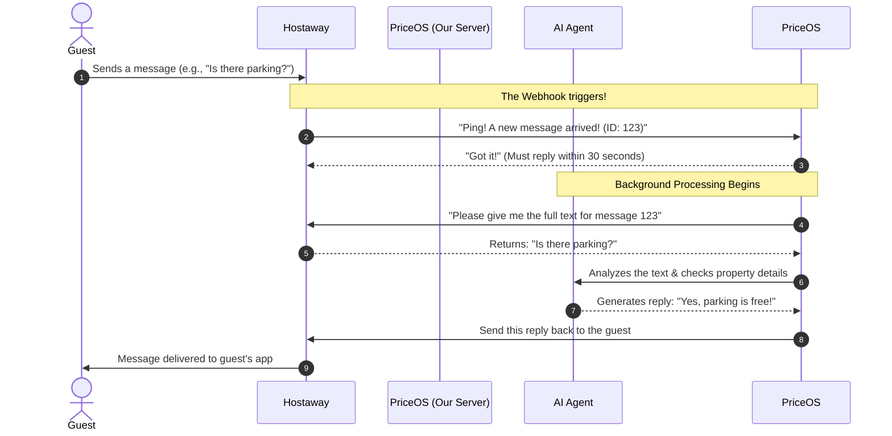

# Hostaway Webhook Integration: A Complete Guide

This document explains exactly how the Hostaway Webhook connects with PriceOS to create an automated "Guest Inbox." It is designed to be easily understood by both technical and non-technical team members.

---

## 1. What is a Webhook?

Think of a webhook like a **digital doorbell**. 

When a guest sends a message on Airbnb, VRBO, or Booking.com, Hostaway acts as the front desk. Instead of PriceOS constantly calling the front desk every 5 seconds asking, *"Are there any new messages?"*, Hostaway simply rings the PriceOS doorbell the exact moment a new message arrives.

*   **No Webhook:** You have to manually check for updates.
*   **With Webhook:** You are notified instantly.

---

## 2. The Automated Workflow (How it Works)

The following flowchart shows the exact sequence of events from the moment a guest sends a message to the moment they receive an AI-generated reply.



---

## 3. Step-by-Step Breakdown

Here is a simple table explaining what happens at each stage of the process:

| Step | Who Does It? | Action | Simple Explanation |
| :--- | :--- | :--- | :--- |
| **1. The Trigger** | **Guest / Hostaway** | A guest sends a message on a booking channel. | Hostaway receives the message and immediately prepares to notify us. |
| **2. The Webhook Ping** | **Hostaway** | Hostaway sends a lightweight "ping" to PriceOS. | Hostaway rings our doorbell. It doesn't send the full message, it just says, *"Hey, you have a new message. Its ID is 123."* |
| **3. The Quick Reply** | **PriceOS** | PriceOS returns a `200 OK` status immediately. | We open the door and say, *"Thanks, I'll handle it!"* to keep Hostaway happy. |
| **4. Fetch Details** | **PriceOS** | PriceOS uses the Message ID to download the full details. | Because the ping didn't contain the actual text, we ask Hostaway for the words the guest typed. |
| **5. AI Processing** | **AI Agent** | The AI reads the text, checks tools/rules, and drafts a reply. | The "Hotel Manager" (AI) thinks about the best way to answer the guest based on property rules. |
| **6. Send Reply** | **PriceOS** | PriceOS sends the final drafted text back to Hostaway. | We hand the final response back to the front desk to deliver to the guest. |

---

## 4. The 30-Second Rule (Crucial Warning!)

The most important rule in this integration is **Hostaway's 30-Second Rule**. 

When Hostaway rings our doorbell (sends the webhook ping), **we must respond with an "OK" status within 30 seconds**. 

**What happens if we take longer than 30 seconds?**
*   **Hostaway thinks we are broken:** They will drop the connection.
*   **The annoying loop:** Hostaway will try to ring the doorbell 3 more times. (This could cause the AI to accidentally reply to the guest 3 times!).
*   **The Kill Switch:** If our system is consistently late for 5 days in a row, Hostaway will permanently **disable** the webhook, breaking the entire automation.

**How we solve this:**
Because an AI Agent takes a long time to "think" (sometimes up to 1 minute), PriceOS is designed to answer the doorbell *instantly* (within 1 second) and pass the heavy lifting (the AI thinking) to the background. 

---

## 5. Setting it up for Testing (Ngrok)

When developers are testing this on their local laptops, they use a tool called **Ngrok**. 

Ngrok provides a temporary public web address (e.g., `https://1234-abcd.ngrok-free.app`) that tricks Hostaway into thinking it's talking to a real, live server on the internet. 

**To set this up via the API:**
We send a one-time request to Hostaway telling them where to point the doorbell:
```json
{
  "isEnabled": 1,
  "url": "https://1234-abcd.ngrok-free.app/webhook",
  "login": null,
  "password": null
}
```
*(Once set, Hostaway will forward all guest messages to that URL until it is changed or disabled).*

---

## 6. Managing the Webhook (For Developers)

Here are the essential cURL commands to manage the Hostaway webhook yourself. 

### 1. The Current Webhook ID
The ID assigned to the currently registered webhook is: **`32620`**

### 2. How to Generate a New Token
Hostaway tokens expire. If you ever get an `authorization server denied the request` error, run this exact command to get a new token. *(It uses the specific `client_id` and `client_secret`)*:

```bash
curl -X POST "https://api.hostaway.com/v1/accessTokens" \
  -H "Content-Type: application/x-www-form-urlencoded" \
  -H "Cache-control: no-cache" \
  -d "grant_type=client_credentials&client_id=145065&client_secret=0b4acd11221b37af8e33a2afb7632418e3e7af26844254537e21c368542aa5f9&scope=general"
```
*When you run this, copy the `"access_token"` string from the JSON response and update the `Hostaway_Authorization_token` in your `.env` file.*

### 3. How to Register a New Ngrok URL
Because you are using the free version of Ngrok, your URL (e.g., `sadistically-calycine-carry.ngrok-free.dev`) will change every time you restart Ngrok. 

When your URL changes, you will need to update Hostaway. Run this command (replace `YOUR_NEW_TOKEN` and the `url` field):

```bash
curl -X POST "https://api.hostaway.com/v1/webhooks/unifiedWebhooks" \
  -H "Authorization: Bearer YOUR_NEW_TOKEN" \
  -H "Content-Type: application/json" \
  -H "Cache-control: no-cache" \
  -d '{
    "isEnabled": 1,
    "url": "https://YOUR-NEW-NGROK-URL.ngrok-free.dev/api/webhook/hostaway",
    "login": null,
    "password": null
  }'
```

### 4. How to Delete the Old Webhook
When your Ngrok URL changes, the old webhook (like ID `32620`) becomes dead. Hostaway will eventually auto-delete it after 5 days of failing, but if you want to clean it up manually, run this (replacing `YOUR_NEW_TOKEN` and `32620` with the ID you want to delete):

```bash
curl -X DELETE "https://api.hostaway.com/v1/webhooks/unifiedWebhooks/32620" \
  -H "Authorization: Bearer YOUR_NEW_TOKEN" \
  -H "Cache-control: no-cache"
```


SImulate Hoastaway Webhook 
curl -X POST "http://127.0.0.1:8000/api/webhook/hostaway/simulate" \
  -H "Content-Type: application/json" \
  -d '{
    "id": "DUMMY-CONV-002",
    "action": "newMessage",
    "orgId": "69d776a671c7b939aaf49053",
    "listingId": "69e059f72c1ef551216ab2a6",
    "guestName": "Test Guest Ahmed",
    "body": "Hi, is there free parking available? Also what time is check-in and the amenities provided ?"
  }'
